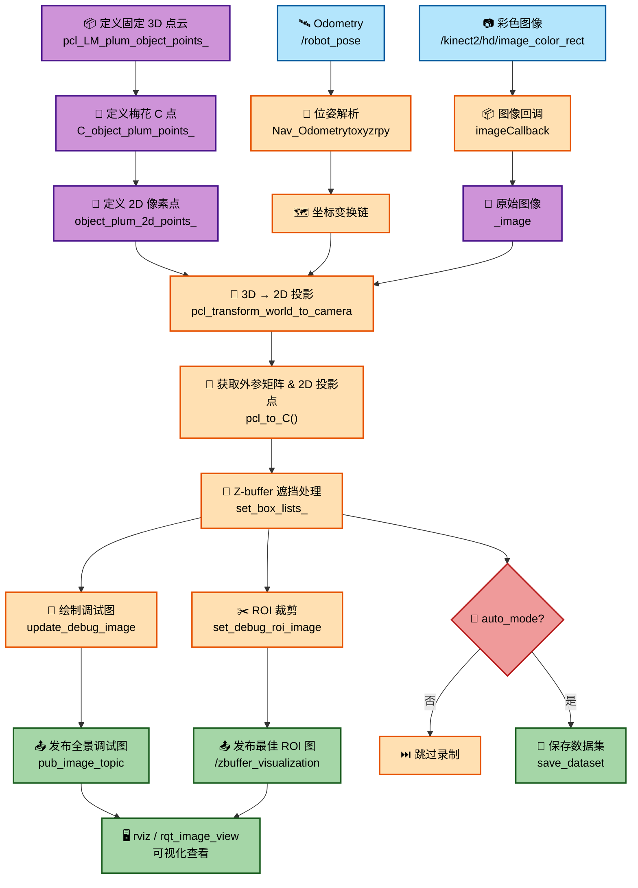

# RC26 Vision Simulation

> RC26 视觉仿真工作区

## 1 项目概述

本项目是 RC26 ”武林探秘的“**视觉感知与数据集录制**工作区，核心是基于 **Z-buffer 的 3D→2D 映射遮挡处理管线**，用于测试梅林的全场识别

### 1.1 核心功能包

| 包名 | 功能 |
|------|------|
| `3dto2d` | **核心感知算法**：Z-buffer 遮挡处理、HSV 目标检测、相机标定、PID 运动控制 |
| `rc_msgs` | 自定义 ROS 消息（感知结果、控制指令） |
| `wpr_simulation` | WPR 机器人仿真环境（传感器、控制、导航、机械臂） |
| `zwei` | Zwei 机器人模型 + **地图数据集**（`map1_add/` 含数百张地图配置） |

### 1.2 配套工具脚本

| 脚本 | 用途 |
|------|------|
| `scripts/random_create_map.py` | 随机生成地图配置（12 点位规则），用于训练数据增强 |
| `scripts/change_data.py` | URDF 日志 → C++ 二维 vector 格式转换 |
| `scripts/change_debug_to_data.py` | 调试图像自动裁剪、重命名并整理为数据集 |

## 2 快速开始

### 2.1 编译

```bash
# 1. 安装缺失的依赖（一次性）
sudo apt install ros-noetic-cv-bridge ros-noetic-image-transport \
                 ros-noetic-pcl-conversions ros-noetic-pcl-ros \
                 ros-noetic-vision-msgs ros-noetic-tf2-ros \
                 ros-noetic-robot-state-publisher \
                 ros-noetic-controller-manager \
                 ros-noetic-joint-state-controller \
                 ros-noetic-move-base-msgs ros-noetic-actionlib \
                 ros-noetic-gazebo-ros ros-noetic-gazebo-plugins

# 2. 编译
cd RC26_Vision_Simulation
source /opt/ros/noetic/setup.bash   # 加载 ROS 环境
catkin_make
source devel/setup.bash

# （可选）生成 compile_commands.json 以获得 VSCode 最佳 IntelliSense 支持
cd build && cmake ../src -DCMAKE_EXPORT_COMPILE_COMMANDS=ON && cd .. && catkin_make
```

### 2.2 快速开始

**加载地图**：(单开一个终端)

```bash
roslaunch zwei arena.launch 
```

**(可选)键盘输入控制机器人移动**：(单开一个终端)

```bash
rosrun wpr_simulation keyboard_vel_ctrl
```

**程序主入口 启动感知节点**：(单开一个终端)

```bash
rosrun 3dto2d zbuffer_func.launch
```

**(可选)以录制数据集的方式开启感知节点**：(单开一个终端)

```bash
rosrun wpr_simulation keyboard_vel_ctrl auto_mode:=true
```

## 3 项目介绍

### 3.1 核心管线流程图



### 3.2 模块说明

| 模块 | 文件 | 功能 |
|------|------|------|
| **固定场景下3D 点预定义** | `package/occlusion_handing.h` | 定义梅花林和方块的世界坐标 |
| **遮挡处理，提取最优信息** | `package/occlusion_handing.cpp` | 综合处理梅花林和方块之间的遮挡，输出全局图像中 12 个位置的最优 ROI 图像信息 |
| **坐标变换** | `package/world_to_camera.h` | 管理世界→雷达→相机三级变换链 |
| **相机标定** | `package/camera_calibration.h` | 相机内参 K、畸变系数、外参矩阵 |
| **主节点** | `zbuffer_func.cpp` | 管线调度、话题订阅/发布、运动控制集成 |


## 4 版本迭代日志

### 4.1 world_ws5 — 远古初始版
- 初始仿真工作区搭建，基础 3D→2D 坐标映射
- Z-buffer 遮挡处理的早期试验
- HSV 空框过滤原型

### 4.2 world_ws6 — 正式重构版
- 重构 `3dto2d` 包目录，引入 `package/` 模块化组织
- 新增 `world_to_camera` 外参标定工具
- 新增 `camera_calibration.h` 相机内参标定
- 删除大量旧版试验文件（`t2dto3d*`、`zbuffer_func_final*` 等），清理代码库
- 优化 Z-buffer 简化算法性能

### 4.3 world_ws7 — HSV 功能测试版
- **新增** `zbuffer_func_node` 主节点，集成完整 Z-buffer 管线
- 引入 `3dto2d_ten_utils` 通用工具库
- 新增大量调试图像输出（`debug/`），可视化 HSV 检测中间结果
- 重构 `set_box_lists` 区域选择逻辑，增加有效点阈值判断
- 优化 `update_debug_image` 多 ROI 拼接显示

### 4.4 world_ws8 — set_box_lists 重构版
- **移除** `debug_hsv` 调试模块（不再单独调试）
- **移除** `zbuffer_simplify` 旧版简化算法
- **新增** `occlusion_handing` 遮挡处理模块
- **修改** `zbuffer_func.cpp`，集成新的遮挡处理

### 4.5 world_ws9 — 旗舰版
- **新增** `camera_calibration.cpp` 相机标定实现（原仅头文件）
- **优化** `occlusion_handing` 遮挡处理算法
  - 重构宏定义，参数可配置化
  - 新增 `roi_valid_flag` 有效区域标志位
  - 引入 Eigen 线性代数库支持
  - 增加现代 C++ 随机数生成与异常处理
- **增强** `method_math` 工具库
  - 新增 PCD 点云文件读写支持
  - 新增 `tvectovector3d` 平移向量转换
  - 新增 `getpath` 路径搜索功能
  - 新增 `readPoseFromTxt` 位姿文件解析
- **编译优化** 启用 `-O2 -Wall -Wextra` 编译选项
- 优化 `world_to_camera` 外参转换精度

### 4.6 world_ws10 — 数据集自动录制版
- **新增** `change_debug_to_data.py`: 调试图像转数据集脚本，支持自动标注
- **新增** `random_create_map.py`: 随机地图生成器，用于训练数据增强
- **新增** `move_controller.cpp/h`: 运动控制模块，支持自动遍历采集
- **新增** `zbuffer_func.launch`: Z-buffer 功能的便捷启动文件
- **新增** `label_100.txt`/`label_150.txt`: 标注数据文件
- **新增** `map1_add`: 扩展地图配置文件
- **移除** `camera_calibration.cpp`（整合至其他模块）
- **移除** `debug/` 调试图像目录（不再需要手动调试）
- **优化** `occlusion_handing` 遮挡参数的标定精度
- **优化** `method_math` 数学工具函数性能

### 4.7 world_ws11 — 偏差与边缘处理引入版
- **新增** `deviation_handing.cpp/h`: 偏差处理模块，补偿检测偏差
- **新增** `edge_handing.cpp`: 边缘检测处理，提升边缘定位精度
- **新增** `hsv_handing.cpp/h`: HSV 颜色检测独立模块
- **新增** `zbuffer_test1.launch`: 测试用启动文件
- **新增** `debug/` 调试图像目录
- **新增** 顶层 `CMakeLists.txt` 工作区构建配置
- **移除** `move_controller` 运动控制模块（迁移至其他工作区）
- **移除** 数据集相关脚本（`change_debug_to_data.py`, `random_create_map.py`）
- **优化** `occlusion_handing` 遮挡处理算法
- **优化** `zbuffer_func` 主节点性能

### 4.8 world_ws12 — PID 控制与运动恢复版
- **新增** `PID.cpp`: PID 控制器模块，提升运动控制精度
- **新增** `basemove2.cpp`: 基础运动控制 v2
- **恢复** `camera_calibration.cpp`: 相机标定功能重新整合
- **恢复** `move_controller.cpp/h`: 运动控制模块回迁
- **恢复** 数据集相关脚本（`change_debug_to_data.py`, `random_create_map.py`）
- **恢复** `zbuffer_func.launch` 启动文件
- **移除** `deviation_handing` 偏差处理（整合至其他模块）
- **移除** `edge_handing` / `hsv_handing` 边缘与 HSV 模块
- **优化** `occlusion_handing` 遮挡处理
- **优化** `zbuffer_func` 主节点融合运动控制

### 4.9 world_ws13 — BaseMoveController 重构版
- **新增** `BaseMoveController.cpp/h`: 重构基础运动控制器，替代旧版 basemove2
- **新增** `change_data.py`: 数据格式转换与处理脚本
- **新增** `01_400.txt`/`label_400.txt`: 更新标注数据集（400 级）
- **移除** `basemove2.cpp`: 被 BaseMoveController 替代
- **移除** `label_100.txt`/`label_150.txt`: 旧版标注数据
- **优化** `occlusion_handing` 遮挡处理算法精度
- **优化** `PID.cpp` 控制器参数
- **优化** `zbuffer_func` 主节点性能与稳定性

### 4.10 world_ws13.5 — 地图数据更新与最终优化版
- **优化** `zbuffer_func.cpp`: 主节点性能微调与稳定性改进
- **更新** `map_*.txt` 地图数据集（大规模地图数据更新）
- **更新** `flag.txt` 地图标志位配置
- **更新** `wpr_simulation.zip` 仿真环境包

## 5 目录结构

```
world_ws/
├── src/
│   ├── 3dto2d/          # 3D→2D 感知包（核心算法）
│   │   ├── src/         # 源文件
│   │   ├── include/     # 头文件
│   │   ├── launch/      # 启动文件
│   │   └── debug/       # 调试图像
│   ├── rc_msgs/         # 自定义 ROS 消息
│   ├── wpr_simulation/  # WPR 机器人仿真
│   └── zwei/            # Zwei 机器人模型
├── build/               # 编译产物
├── devel/               # 开发空间
└── README.md
```
